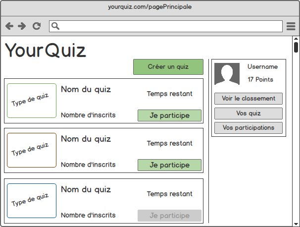

# YouQuiz - Spécifications

*Raed ABDENNADHER, Mayron BOUCHET, Matthieu CONSTANT, Nicolas DENBY, Nathanael NUFER, Steven LIATTI*

## Analyse

Dans cette partie d'analyse seront regroupées les exigences du projet ainsi que l'analyse des risques.

### Définition des rôles

 **Utilisateur anonyme**

- Inscription
- Connexion
- Visualiser les quiz disponibles

**Utilisateur connecté**

- Créer un quiz
- S'inscrire à un quiz
- Participer à un quiz
- Supprimer un quiz (définir dans quelles conditions)
- Visualiser le classement

### Définition des besoins (exigences)

#### Exigences du projet

- Définir des règles

- Les rôles des utilisateurs

- Réalisation d'un client Web et Mobile

- Déploiement Cloud

- Effectuer une montée en charge

- Mettre en place des tests de performance

#### Exigences fonctionnelles

##### Les fonctions et les services offerts par le logiciel

1. Sign In
2. Login
3. Logout
4. Création d'un quiz
5. Inscription à un ou plusieurs quiz
6. Participer à un quiz
7. Voir la liste des quiz

#### Exigences non fonctionnelles

- Disponibilité
- Performance (gérer un grand nombre d'utilisateurs)
- Pas de triche

## Règles de fonctionnement du site

### Participation

Un quiz commence à un instant t. L'utilisateur peut commencer à répondre (démarrer) au quiz jusqu'à l'instant u (défini par le créateur). Par exemple : un quiz est ouvert de 12h à 18h. Les joueurs peuvent le commencer jusqu'à 17h59.

La structure des questions est la suivante : pour une question, il y aura 4 réponses possibles et une seule bonne réponse. Une limite maximale de temps par question est définie. Cependant, une limite minimale et maximale seront définies par défaut (par exemple: min = 3 sec, max = 60 sec). Chaque question peut avoir un temps maximum différent.

L'utilisateur est obligé de répondre à la question pour pouvoir continuer. Si l'utilisateur n'a pas répondu à la question avant la fin du temps imparti la réponse est considérée comme fausse et il passe automatiquement à la question suivante. Lorsqu'il répond à la question, on lui indique s'il a correctement répondu et on passe à la question suivante. L'utilisateur ne peut pas revenir en arrière. Il peut voir son score en tout temps et son avancement dans le questionnaire.

Un système de coefficient multiplicateur par bonne réponse est présent. Au fur et à mesure que l'utilisateur répond juste aux questions, un coeffcient augmente jusqu'à une réponse fausse qui remet ce coefficient bonus à 0.

Un questionnaire ne peut pas être refait. À la fin du quiz, on obtient un résumé de notre participation (bonnes/mauvaises réponses, score) et une note et des commentaires peuvent être donnés. Un système de ranking des quiz et créateurs de quiz sera mis en place.

### Création

N'importe quel utilisateur peut créer un quiz, mais il ne peut pas participer à ses propres quiz. L'utilisateur choisi le nom, la description, le thème, le nombre de questions et les réponses possibles. Les utilisateurs peuvent signaler les quiz à contenu inapproprié. Si un certain nombre de clients signalent le quiz, une notification est envoyée aux administrateurs. 

Un quiz populaire pourrait avoir la possibilité d'être relancé après un certain temps. Une fois que le quiz est publié, son créateur ne peut ni le modifier ni le supprimer et les joueurs peuvent y participer. Une fois la période de jeu terminée, le créateur du quiz peut à nouveau modifier/supprimer le quiz.

### Consultation et recherche d'un quiz

Les joueurs peuvent chercher les quiz par créateur, thème (tags). Il peuvent lire la description du quiz.

## Modélisation

### Diagrammes d’activités

#### Login

```flow
login=>start: Accès à la page de login
form=>operation: Complétion du formulaire
cond=>condition: Identifiants corrects ?
valid=>end: Connecté
login->form
form->cond(no)->form
form->cond(yes)->valid
```


### Maquettes




